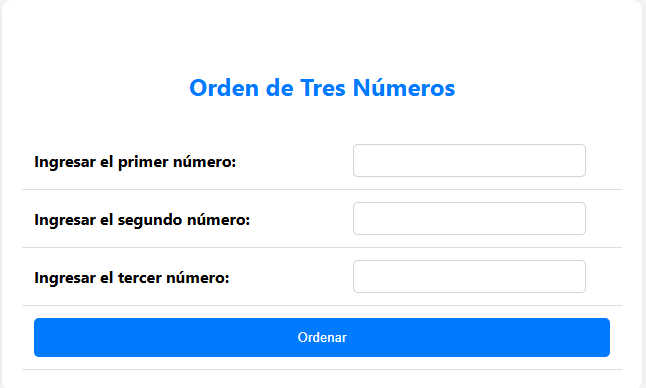

# Ordenamiento de Tres Números

Esta actividad web implementa una aplicación interactiva que permite a los usuarios ingresar tres números y ordenarlos de manera ascendente. Utiliza HTML y CSS para la interfaz de usuario y PHP para procesar y ordenar los números ingresados.

  

El script PHP procesa los datos ingresados en el formulario:

- **Obtención de Datos:** Recibe los números ingresados a través de $\_POST.

- **Ordenamiento de Números:** Utiliza condicionales para ordenar los números en orden ascendente: Determina el número más pequeño, mediano y más grande comparando los valores.

- **Generación de Salida:** Imprime el resultado en orden ascendente.

Esta actividad demuestra habilidades en el desarrollo de aplicaciones web interactivas utilizando tecnologías de front-end y back-end, ofreciendo una funcionalidad útil y una interfaz de usuario atractiva y fácil de usar.

**Consulta la versión preliminar de la actividad aquí:** [https://ejercicio_05.com](https://www.alejandrovillegas.dev/projects/exercise-05/index.html)

# 📌 Información de la Actividad

Esta actividad ha sido desarrollado como parte del portafolio de soluciones tecnológicas, con el objetivo de ofrecer una herramienta eficiente y funcional para usuarios autodidactas interesados en la gestión y desarrollo de proyectos web.

- **Área**: Desarrollo de Actividades Web

- **Usuario Final**: TecNM

- **Fecha de Desarrollo**: 23 de mayo de 2018

- **Portafolio de Proyectos**: [www.alejandrovillegas.dev](https://www.alejandrovillegas.dev)

## 🔧 Guía de Instalación y Configuración de la Actividad

1. Descargue y descomprima el archivo del proyecto en su sistema local.

La actividad ahora está funcionando en su entorno local. 🎉
